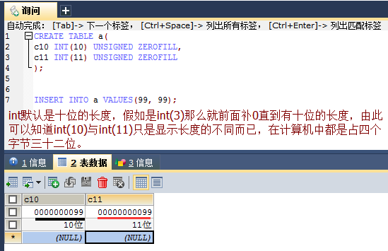

[TOC]

# 数据库学习笔记

## 1. 基础命令

### 1.1 库表相关命令

####  1.1.1 查看自己当前使用的库

- 方法一

```mysql
mysql> select database();
+------------------+
| database()       |
+------------------+
| db_cxpay_collect |
+------------------+
1 row in set (0.00 sec)
```

#### 1.1.2 查看当前数据库有多少库

- 方法一

```mysql
mysql> show databases;
```

- 方法二

```mysql
mysql> use information_schema;select * from SCHEMATA;
```

#### 1.1.3  复制表结构但是不复制表数据

```mysql
create table t_ticket_sync_seq_201901 as select * from t_ticket_sync_seq_201812 where 1=2;
```

#### 1.1.4 为数据库字段设置默认值

```mysql
alter table t_driver alter column Fcompany set default "黄岛公司";
```


### 1.2 数据库系统相关命令

####  1.2.1 查看当前数据库的版本信息

```mysql
mysql> select verison(); 
```

## 2. 进阶知识

#### 2.1 库表相关命令

##### 2.1.1 datediff

- 查询出t_employess表中'1963-04-03'以后出生的最大员工号

  ```mysql
  SELECT max(emp_no) FROM t_employess WHERE datediff(birth_date,'1963-04-03');
  ```

  

#####  2.1.2 information_schema

`SCHEMATA`：提供了当前mysql实例中所有数据库的信息。是`show databases`的结果取之此表


#### 2.2 数据库系统相关命令

##### 2.2.1 如何查找当前数据库的配置文件

1. `mysql --help|grep my.cnf`

   ```mysql
   [tt@0a0ef2b57fad /usr/local/apache/conf]$ mysql --help|grep my.cnf
                         order of preference, my.cnf, $MYSQL_TCP_PORT,
   /etc/my.cnf /etc/mysql/my.cnf /usr/local/zftmysql/etc/my.cnf ~/.my.cnf
   ```

##### 2.2.2 如何查找当前数据库的可执行文件

1. 一般是在`basedir`目录下的`bin`文件夹下

##### 2.2.3 重启mysql

- 以tlinux为例。先关闭-->`sudo ./mysqladmin -uroot -p shutdown`
- 再启动，-->`sudo ./mysqld_safe &`

##### 2.2.4 数据库添加强校验模式

- 如何添加？

  1. 方法1：只对当前链接有效

     ```mysql
     set sql_mode="STRICT_TRANS_TABLES,NO_AUTO_CREATE_USER,NO_ENGINE_SUBSTITUTION";
     ```

  2. 方法2：在`my.cnf`的`mysqld`标签下添加如下内容：

     ```mysql
     sql-mode="STRICT_TRANS_TABLES,NO_AUTO_CREATE_USER,NO_ENGINE_SUBSTITUTION"
     ```

     **==注意：==**my.cnf的配置权限一定要配置成`chmod 0444 my.cnf`，不要配置成chmod 777 my.cnf，否则会出现`[Warning] World-writable config file '/etc/mysql/docker-default.d/my.cnf' is ignored `导致配置不生效

##### 2.2.5 利用explain判断查询语句是否使用了索引

- 用法：在`select语句`前加上`explain`

  ```sql
  mysql> explain select * from t_order_debt;
  +----+-------------+--------------+------+---------------+------+---------+------+------+-------+
  | id | select_type | table        | type | possible_keys | key  | key_len | ref  | rows | Extra |
  +----+-------------+--------------+------+---------------+------+---------+------+------+-------+
  |  1 | SIMPLE      | t_order_debt | ALL  | NULL          | NULL | NULL    | NULL |  226 |       |
  +----+-------------+--------------+------+---------------+------+---------+------+------+-------+
  1 row in set (0.00 sec)
  
  ```

- 如何判断是否使用了索引

  根据上述查询结果的`type`字段，如果type字段等于`ALL`,没有使用索引。如果type字段等于`RANGE`,使用了索引

#### 2.3 mysql系统函数

##### 2.3.1 MID函数

> 用于得到一个字符串的一部分

- 函数原型：MID(column_name,start[,length])

  **注意**：MID函数的start位开始为1，不是0

- 应用：

  ```MYSQL
  mysql> SELECT MID(VERSION(),1,16);
  +---------------------+
  | MID(VERSION(),1,16) |
  +---------------------+
  | 5.5.24-log          |
  +---------------------+
  1 row in set (0.00 sec)
  ```

#### 2.4 数据类型

##### 2.4.1 int(10)和int(11)的区别

int(M),M代表显示宽度。如果不使用ZEROFILL填充结果，int(10)和int(11)无任何区别。如果使用ZEROFILL填充，效果如下：

#### 

#### 2.5 binlog

##### 2.5.1在binlog中查找删除的数据并恢复

> 背景：司机被删除了。如何恢复呢？

- **binlog哪里找？**

  形如/data/zftMysqlData/binlog/binlog.000011

- 如何确认是哪个binlog

  ```mysql
  mysql> show master status;
  +---------------+----------+--------------+------------------+
  | File          | Position | Binlog_Do_DB | Binlog_Ignore_DB |
  +---------------+----------+--------------+------------------+
  | binlog.000011 | 72100881 |              |                  |
  +---------------+----------+--------------+------------------+
  
  ```

- **mysqlbinlog哪里找？**

  /usr/local/zftmysql/bin

- **如何恢复指定库，指定时间的数据？**

  sudo ./mysqlbinlog  --database=db_icc_drvcar --start-datetime='2019-09-05 14:00:00'  --stop-datetime='2019-09-05 14:30:00'  -v  --base64-output=decode-rows  /data/zftMysqlData/binlog/binlog.000011

  1. --database= 指定数据库
  2. --start-datetime,--stop-datetime指定开始时间，结束时间
  3. -v 显示出SQL语句

  ```mysql
  ### DELETE FROM db_icc_drvcar.t_driver
  ### WHERE
  ###   @1=400000001
  ###   @2='为社'
  ###   @3='谭'
  ###   @4='S9AppJ8f8mnbPNfZbHyP0w=='
  ###   @5='3d74ca69-3142-4c0e-9770-6eb2917fcd93'
  ###   @6=1
  ###   @7=10004
  ###   @8=10004
  ###   @9='青岛交运'
  ###   @10=''
  ###   @11=1
  ###   @12='12580http://tst.tst.mauu.me/dnsrebending?d6409bc382b12555b5a01bb8d5be6cb2'
  ###   @13='https://wyc10001-30132.picsz.qpic.cn/static/wyc_topic/ed0fb9a29760b4824d9900b1d2e91c10af88f228'
  ###   @14='f7418d71503a6b4b49db841bd484eefaac3d210f'
  ###   @15=2019-09-02 16:36:18
  ###   @16=2019-09-03 20:21:06
  ###   @17='ecaea3d799d22e41c1db893784921560'
  ### DELETE FROM db_icc_drvcar.t_driver
  ### WHERE
  ###   @1=400000005
  ###   @2='三'
  ###   @3='张'
  ###   @4='S9AppJ8f8mnbPNfZrtHyP0w=='
  ###   @5=''
  ###   @6=1
  ###   @7=10004
  ###   @8=10004
  ###   @9='黄岛公司'
  ###   @10=''
  ###   @11=1
  ###   @12='00001'
  ###   @13='https://wyc10001-30132.picsz.qpic.cn/static/wyc_topic/ed0fb9a29760b482455300b1d2e91c10af88f228'
  ###   @14=''
  ###   @15=2019-09-02 20:02:07
  ###   @16=2019-09-02 20:02:07
  ###   @17='7a5873fdf221288f44ea08fab38dd275'
  ```


#### 2.6 事务锁

##### 2.6.1 锁超时

- 报错信息：Lock wait timeout exceeded;try restarting transaction

- 解决方法：

  1. SELECT  * FROM information_schema.innodb_trx

  2. kill trx_mysql_thread_id;

     

